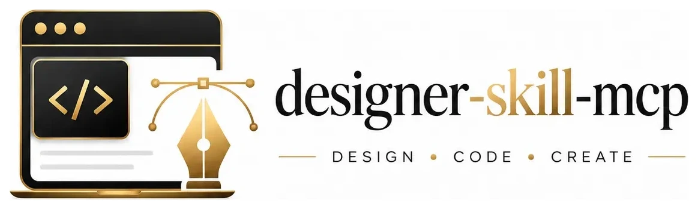

<div align="center">



**Plug-and-play MCP. UI superpowers for your agent.**

<br />

[](#setup)
[](https://www.npmjs.com/package/designer-skill-mcp)
[](https://www.npmjs.com/package/designer-skill-mcp)
[](LICENSE)

<br />

[](#setup)
[](#reference)
[](#tools)
[](#tools)

<br />

[Overview](#overview) · [Setup](#setup) · [Reference](#reference) · [Tools](#tools) · [Development](#development)

```bash
npm i designer-skill-mcp
```

</div>

<br />

<div align="center">

[](#overview)

</div>

**designer-skill-mcp** is a small [MCP](https://modelcontextprotocol.io) server you add in one line. Your agent gets design tools, reference docs, and a ship gate so UI work stops looking generic.

**What your agent gains:**

| Superpower | What it does |
|---|---|
| **Route** | `dispatch_intent` maps "make it pop" or "it feels off" to the right move |
| **Know** | 13 reference files: type, color, motion, a11y, anti-slop, redesign loops |
| **Check** | 44-rule detector + `anti_slop_checklist` before shipping |

Add the server. Ask in plain language. The agent handles the rest.

<div align="center">

[](skills/designer-skill/)
[](designer-skill-mcp/)

</div>

<br />

<div align="center">

[](#setup)

</div>

### Plugin (recommended)

<div align="center">

[](#setup)
[](#setup)

</div>

One install gets both the skill and the MCP server:

```
/plugin marketplace add Pythoughts-labs/designer-skill
/plugin install designer-skill@pythoughts-labs
```

Codex CLI:

```bash
codex plugin marketplace add Pythoughts-labs/designer-skill
```

Then install **designer-skill** from the **pythoughts-labs** marketplace in `/plugins`. The skill appears as `designer-skill:designer-skill`.

### Plug in (any client)

Same one-liner everywhere. No API key. No config files to write by hand:

```json
{
  "mcpServers": {
    "designer-skill": {
      "command": "npx",
      "args": ["-y", "designer-skill-mcp"]
    }
  }
}
```

<div align="center">

[](docs/blog/integrating-designer-skill-with-pythinker.md)
[](https://github.com/openai/codex)
[](https://claude.ai/code)
[](https://cursor.com)
[](https://code.visualstudio.com)
[](https://kilocode.ai)
[](https://opencode.ai)
[](https://github.com/earendil-works/pi-coding-agent)

</div>

| Client | Quick install |
|---|---|
| **Pythinker** | `pythinker mcp add --transport stdio designer-skill -- npx -y designer-skill-mcp` · [guide](docs/blog/integrating-designer-skill-with-pythinker.md) |
| **Codex CLI** | `codex mcp add designer-skill -- npx -y designer-skill-mcp` |
| **Claude Code** | `claude mcp add designer-skill -- npx -y designer-skill-mcp` |
| **Cursor** | `.cursor/mcp.json` or Settings → MCP |
| **VS Code** | `.vscode/mcp.json` (`"servers"` + `"type": "stdio"`) |
| **Kilo Code** | MCP Settings → `mcp_settings.json` |
| **Open Code** | `opencode.json` (key `"mcp"`) |
| **Pi** | MCP config or native skill path |

<details>
<summary><strong>Per-client config snippets</strong></summary>

**Pythinker** (`~/.pythinker/mcp.json`)

```json
{ "mcpServers": { "designer-skill": { "command": "npx", "args": ["-y", "designer-skill-mcp"] } } }
```

Verify: `pythinker mcp test designer-skill` · TUI: `/mcp` lists the server, `/tools` shows `mcp_designer-skill_*`.

**Codex CLI** (`~/.codex/config.toml`)

```toml
[mcp_servers.designer-skill]
command = "npx"
args = ["-y", "designer-skill-mcp"]
```

**Claude Desktop** (`~/Library/Application Support/Claude/claude_desktop_config.json`)

```json
{ "mcpServers": { "designer-skill": { "command": "npx", "args": ["-y", "designer-skill-mcp"] } } }
```

**Cursor** (`.cursor/mcp.json` at repo root, same JSON shape as Pythinker)

**VS Code** (`.vscode/mcp.json`, requires 1.99+ or MCP extension)

```json
{
  "servers": {
    "designer-skill": {
      "type": "stdio",
      "command": "npx",
      "args": ["-y", "designer-skill-mcp"]
    }
  }
}
```

**Kilo Code** (MCP Settings → Edit MCP Settings)

```json
{
  "mcpServers": {
    "designer-skill": {
      "command": "npx",
      "args": ["-y", "designer-skill-mcp"],
      "disabled": false,
      "alwaysAllow": []
    }
  }
}
```

**Open Code** (`opencode.json` or `~/.config/opencode/config.json`)

```json
{
  "mcp": {
    "designer-skill": {
      "type": "local",
      "command": ["npx", "-y", "designer-skill-mcp"]
    }
  }
}
```

**Pi** (MCP config, same JSON as Pythinker, or register the skill natively):

```json
{ "skills": [{ "path": "/path/to/skills/designer-skill/SKILL.md" }] }
```

</details>

### Skill-only

<div align="center">

[](#setup)

</div>

```bash
cp -r skills/designer-skill/ ~/.claude/skills/designer-skill/   # Claude Code
cp -r skills/designer-skill/ ~/.codex/skills/designer-skill/     # Codex
```

Invoke with the Skill tool or `$designer-skill` on design tasks.

### Invoke

<div align="center">

```
Use designer-skill to redesign this pricing page without breaking functionality.
```

`get_design_system` → `dispatch_intent` → `get_reference` → work → `anti_slop_checklist`

</div>

<br />

<div align="center">

[](#reference)

</div>

### Files

| File | Use when |
|---|---|
| `design-principles.md` | Typography, spacing, color, layout, hierarchy (neutral baseline) |
| `aesthetic-systems.md` | Picking a look: 5 systems with palettes, fonts, shadows |
| `motion-and-interaction.md` | Animation timing, springs, scroll, reduced-motion |
| `engineering-and-performance.md` | Tokens, a11y, responsive, Core Web Vitals, real-data hardening |
| `avoid-ai-slop.md` | Ban-list, category-reflex checks, output-completeness contract |
| `refactor-and-redesign.md` | Audit → diagnose → redesign without breaking behavior |
| `command-playbook.md` | Intent → verb dispatch (build, polish, bolder, harden, …) |
| `interaction-design.md` | Fitts/Hick/Miller, forms, navigation, errors, loading states |
| `visual-critique.md` | Seven-dimension critique instrument |
| `design-systems.md` | Token architecture, component specs, theming |
| `project-init.md` | Discovery interview, PRODUCT.md, DESIGN.md setup |
| `craft-flow.md` | Shape-then-build pipeline with user gates |
| `live-mode.md` | Browser variant mode: element select, HMR, poll/steer/accept |

<div align="center">

[](#reference)
[](#reference)

</div>

### Intent → verb

| Phrase | Verb(s) | Read |
|---|---|---|
| "make it pop" | `bolder` · `colorize` | `aesthetic-systems`, `design-principles` |
| "it feels off" | `audit` · `diagnose` | `refactor-and-redesign`, `avoid-ai-slop` |
| "production-ready" | `harden` · `a11y` | `engineering-and-performance` |
| "add some motion" | `animate` | `motion-and-interaction` |
| "it looks AI-made" | `de-slop` · `differentiate` | `avoid-ai-slop`, `aesthetic-systems` |
| "redesign this" | `audit` · `redesign` | `refactor-and-redesign`, `command-playbook` |

### Preflight

1. Scope the surface: **brand** register (distinctiveness) vs **product** register (earned familiarity).
2. Commit to one aesthetic system; never mix two signatures on one surface.
3. Run the category-reflex check in `avoid-ai-slop.md`.
4. Build on `design-principles.md` + `engineering-and-performance.md`; add motion last.
5. For existing UI, audit → diagnose → redesign. Do not rebuild from scratch.
6. Run the ship gate (`anti_slop_checklist`) before declaring done.

<br />

<div align="center">

[](#tools)

</div>

| Tool | Purpose |
|---|---|
| `get_design_system` | SKILL.md router (call first) |
| `load_project_context` | Read PRODUCT.md / DESIGN.md from the project |
| `get_reference` | One of thirteen reference files by name |
| `list_commands` | All design verbs with descriptions |
| `get_command` | Full guidance + references for a specific verb |
| `dispatch_intent` | Map a request → verb(s) + files to read |
| `detect_antipatterns` | Deterministic scan (44 rules), no LLM, no API key |
| `get_palette_seed` | OKLCH brand-seed for greenfield palette work |
| `anti_slop_checklist` | Ship gate: run before finishing any UI work |

<div align="center">

[](#tools)
[](#tools)

</div>

**Resources:** `designer://skill` · `designer://reference/{name}`

**Prompt:** `design` (args: `task` required, `aesthetic` optional)

<br />

<div align="center">

[](#development)

</div>

```bash
cd designer-skill-mcp
npm install
npm run build   # syncs skills/designer-skill/ → assets/skill/, compiles TypeScript
npm test
```

**HTTP mode** (remote clients):

```bash
node dist/index.js --http --port 3017             # 127.0.0.1 (default)
node dist/index.js --http --port 3017 --host 0.0.0.0  # public: add auth/proxy
```

Endpoint: `http://127.0.0.1:3017/mcp` (Streamable HTTP). Includes Origin guard against DNS-rebinding; no built-in auth for public exposure.

**Local checkout:** replace `npx` with `"command": "node", "args": ["/abs/path/to/designer-skill-mcp/dist/index.js"]` in any config above.

<br />

<div align="center">

[](LICENSE)
[](designer-skill-mcp/)
[](skills/designer-skill/)

</div>
